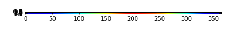
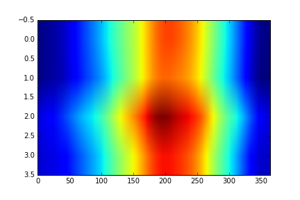
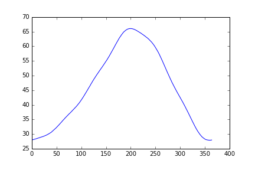
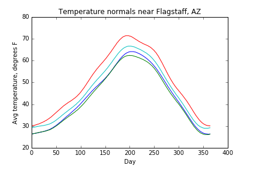
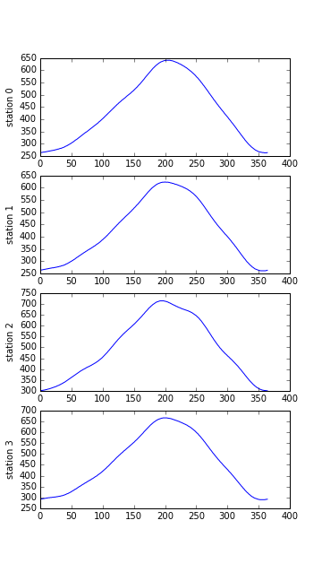

> ## Learning Objectives {.objectives}
>
> *   Explain what a library is, and what libraries are used for.
> *   Load a Python library and use the things it contains.
> *   Read tabular data from a file into a program.
> *   Assign values to variables.
> *   Select individual values and subsections from data.
> *   Perform operations on arrays of data.
> *   Display simple graphs.

While a lot of powerful tools are built into languages like Python,
even more live in the [libraries](reference.html#library).

In order to load our temperature data,
we need to [import](reference.html#import) a library called NumPy.
In general you should use this library if you want to do fancy things with numbers,
especially if you have matrices or arrays.
We can load NumPy using:

~~~ {.python}
import numpy
~~~

Importing a library is like getting a box of lab equipment out of a storage locker, inventorying the contents,
and setting the box on the bench. Libraries provide additional functionality to Python just like a new piece of equipment adds functionality to a lab space.
Once we've loaded the library,
we can use NumPy to read the data file:

~~~ {.python}
numpy.loadtxt('data/temperature.csv', delimiter=',')
~~~
~~~ {.output}
array([[ 264.,  264.,  264., ...,  263.,  263.,  264.],
       [ 263.,  264.,  264., ...,  262.,  262.,  263.],
       [ 301.,  302.,  302., ...,  301.,  301.,  301.],
       [ 292.,  293.,  293., ...,  291.,  292.,  292.]])
~~~

The expression `numpy.loadtxt(...)` is a [function call](reference.html#function-call)
that tells Python to run the function `loadtxt` from the `numpy` library.
This [dotted notation](reference.html#dotted-notation), with the syntax `thing.component`, is used everywhere in Python
to refer to the parts of things.

The function call to `numpy.loadtxt` has two [parameters](reference.html#parameter):
the name of the file we want to read
and the [delimiter](reference.html#delimiter) that separates values on a line.
Both need to be character strings (or [strings](reference.html#string) for short)
so we write them in quotes.

Within the Jupyter iPython notebook, pressing Shift+Enter runs the commands in the selected cell.
Because we haven't told iPython what to do with the output of `numpy.loadtxt`, the notebook just displays the output to the screen. In this case, the output is the data we loaded from the temperature file. By default, only a few rows and columns are shown (with `...` to omit elements when displaying big arrays). To save space, Python displays numbers as `1.` instead of `1.0` when there's nothing interesting after the decimal point.

The function call `numpy.loadtxt` read the temperature file but didn’t save it somewhere we can access it. In order to use the data within Python, we need to assign [assign](reference.html#assignment) the array to a [variable](reference.html#variable). A variable is just a name that refers to an object. Python’s variables must begin with a letter and are [case sensitive](reference.html#case-sensitive). We can assign a variable name to an object using `=`.

>## Naming objects {.callout}
> 
>What happens when a function is called but the output is not assigned to a variable is a bit more complicated than
>simply not saving the values to memory. The call to `numpy.loadtxt` read the file and created an object in memory containing the data,
>but because we didn't assign it to a variable name, we would only be able to call this object if we knew its address in memory. While this difference might 
>seem irrelevant (and, in practice, it is!), it will be important to consider how variable names are assigned to objects 
>when we talk about mutable and immutable objects later on.
>
>A good explanation (although a bit jargony) of how Python handles variables and objects can be found here:
>[Is Python call-by-value or call-by-reference? Neither.](https://jeffknupp.com/blog/2012/11/13/is-python-callbyvalue-or-callbyreference-neither/)

To fully understand what variables and objects are related, let's consider the simplest "collection" of data:
a single value.
The line below assigns the value `55` to a variable `weight_kg`:

~~~ {.python}
weight_kg = 55
~~~

Once a variable is assigned to an object, we can print the value in the object to the screen:

~~~ {.python}
print weight_kg
~~~
~~~ {.output}
55
~~~

and do arithmetic with it:

~~~ {.python}
print 'weight in pounds:', 2.2 * weight_kg
~~~
~~~ {.output}
weight in pounds: 121.0
~~~

We can also change a variable's value by assigning it a new one:

~~~ {.python}
weight_kg = 57
print 'weight in kilograms is now:', weight_kg
~~~
~~~ {.output}
weight in kilograms is now: 57
~~~

As the example above shows,
we can print several things at once by separating them with commas.

If we imagine the variable as a sticky note with a name written on it,
]variable assignment](reference.html#assignment) is like putting the sticky note on a particular box containing some information:

This means that assigning a value to any one variable does *not* change the values of objects associated with other variables.
For example,
let's store the subject's weight in pounds in a variable:

~~~ {.python}
weight_lb = 2.2 * weight_kg
print 'weight in kilograms:', weight_kg, 'and in pounds:', weight_lb
~~~
~~~ {.output}
weight in kilograms: 57 and in pounds: 125.4
~~~

and then change `weight_kg`:

~~~ {.python}
weight_kg = 100.0
print 'weight in kilograms is now:', weight_kg, 'and weight in pounds is still:', weight_lb
~~~
~~~ {.output}
weight in kilograms is now: 100.0 and weight in pounds is still: 125.4
~~~

Since the variable name `weight_lb` doesn't "remember" how it came to be associated with "125.4",
its value isn't automatically updated when `weight_kg` changes.
This is different from the way spreadsheets work, where changing the value of a cell cascades to any values that are calculated from it.

>## Integers and floats {.callout}
>
>You might have noticed that we wrote the value assigned to `weight_kg` both
> with and without a decimal point. From the perspective of a computer, these two numbers are objects of
> different [type](reference.html#type: integers and floating point numbers (or floats).
>
>~~~{.python}
> weight_kg_int = 57
>weight_kg_float = 57.0
>
>print weight_kg_int, 'is', type(weight_kg_int)
>print weight_kg_float, 'is',  type(weight_kg_float)
>~~~
>~~~ {.output}
>57 is <type 'int'>
>57.0 is <type 'float'>
>~~~
>
>Addition, subtraction and multiplication work on both integers and floats as we’d expect, but division works differently. If we divide one integer by another, we get the quotient without the remainder:
>
>~~~{.python}
>print weight_kg_int, '/ 2 is', weight_kg_int / 2
>print weight_kg_float, '/ 2 is', weight_kg_float / 2
>~~~
>~~~ {.output}
>57 / 2 is 28
>57.0 / 2 is 28.5
>~~~
>
>If either part of the division is a float, the computer creates a floating-point answer:
>~~~{.python}
>print weight_kg_float, '/ 2 is', weight_kg_float / 2
>print weight_kg_int, '/ 2.0 is', weight_kg_int / 2.0
>~~~
>~~~ {.output}
>57.0 / 2 is 28.5
>57 / 2.0 is 28.5
>~~~
>
>To convert an object from one type to another, we can cast the variable as the new type:
>
>~~~{.python}
>print 'float(', weight_kg_int, ') is', type(float(weight_kg_int))
>print 'float(', weight_kg_int, ') / 2.0 is', float(weight_kg_int) / 2.0
>~~~
>~~~ {.output}
>float( 57 ) is <type 'float'>
>float( 57 ) / 2.0 is 28.5
>~~~
>The computer does this for historical reasons: integer operations were much faster on early machines, and this behavior is actually useful in a lot of situations. However, it’s still confusing, so Python 3 produces a floating-point answer when dividing integers if it needs to. We’re using Python 2.7 in this workshop, though, so we have to keep this in mind.

> ## Who's who in the memory {.callout}
>
>You can use the `whos` command at any time to see what variables you have created and what modules you have loaded into the computers memory. This is an IPython command so it will only work if you are in an IPython terminal or the Jupyter Notebook. 
>
>~~~ {.python}
>whos
>~~~
>~~~ {.output}
>Variable    Type       Data/Info
>--------------------------------
>numpy       module     <module 'numpy' from '/Us<...>kages/numpy/__init__.py'>
>weight_kg   float      100.0
>weight_lb   float      125.4
>~~~

Just as we can assign a single value to a variable, we can also assign an array of values
to a variable using the same syntax.  Let's re-run `numpy.loadtxt` and assign the output of the function call to a variable:

~~~ {.python}
data = numpy.loadtxt('data/temperature.csv',delimiter=',')
~~~

This statement doesn't produce any visible output but we can look at the object using `print`:

~~~ {.python}
print data
~~~
~~~ {.output}
[[ 264.  264.  264. ...,  263.  263.  264.]
 [ 263.  264.  264. ...,  262.  262.  263.]
 [ 301.  302.  302. ...,  301.  301.  301.]
 [ 292.  293.  293. ...,  291.  292.  292.]]
~~~

By default, the temperature data has units of 10ths of a degree Fahrenheit. Let's load it again and convert it to degrees Fahrenheit by dividing every item in the array by 10. To avoid accidentally introducing errors through integer division, we should divide the data by a float just in case the data imports as integers. These small details make your code more robust and reusable!

~~~ {.python}
data = numpy.loadtxt('data/temperature.csv',delimiter=',') / 10.
print data
~~~
~~~ {.output}
[[ 26.4  26.4  26.4 ...,  26.3  26.3  26.4]
 [ 26.3  26.4  26.4 ...,  26.2  26.2  26.3]
 [ 30.1  30.2  30.2 ...,  30.1  30.1  30.1]
 [ 29.2  29.3  29.3 ...,  29.1  29.2  29.2]]
~~~

> ## Check your understanding {.challenge}
>
> Draw diagrams showing what variables refer to what values after each statement in the following program:
>
> ~~~ {.python}
> mass = 47.5
> age = 122
> mass = mass * 2.0
> age = age - 20
> ~~~

> ## Sorting out references {.challenge}
>
> What does the following program print out?
>
> ~~~ {.python}
> first, second = 'Grace', 'Hopper'
> third, fourth = second, first
> print third, fourth
> ~~~

Let's see what [type](reference.html#type) of object the variable `data` refers to:

~~~ {.python}
print type(data)
~~~
~~~ {.output}
<class 'numpy.ndarray'>
~~~

The output tells us that `data` currently refers to an N-dimensional array created by the NumPy library. We can see what its [shape](reference.html#shape) is like this:

~~~ {.python}
print data.shape
~~~
~~~ {.output}
(4, 365)
~~~

This tells us that `data` has 4 rows and 365 columns. This array contains daily average temperature normals (data averaged over 30 years) for four weather stations around Flagstaff, AZ. The rows are the individual stations and the columns are the average temperatures for each day of the year.

The object associated with the variable `data` contains not just the values in the array but also information about the array. These are the [members](reference.html#member) or
attributes. This extra information describes `data` in
the same way an adjective describes a noun:
`data.shape` is an attribute  of `data` that described the dimensions of `data`.
We use the same dotted notation for the attributes of variables
that we use for the functions in libraries
because they have the same part-and-whole relationship.

If we want to pull a single number from the array,
we use the [index](reference.html#index) of that entry in square brackets:

~~~ {.python}
print 'first value in data:', data[0, 0]
~~~
~~~ {.output}
first value in data: 26.4
~~~

~~~ {.python}
print 'middle value in data:', data[2, 180]
~~~
~~~ {.output}
middle value in data: 69.6
~~~

> ## Zero-based indexing {.callout}
>
>The expression `data[0, 0]` may surprise you.
>Programming languages like Fortran and MATLAB start counting at 1
>because that's what human beings have done for thousands of years.
>Languages in the C family (including C++, Java, Perl, and Python) count from 0
>because that's simpler for computers to do.
>As a result,
>an M&times;N array in Python,
>its indices go from 0 to M-1 on the first axis
>and 0 to N-1 on the second.
>This takes a bit of getting used to,
>but one way to remember the rule is that
>the index is how many steps we have to take from the start to get the item we want.

> ## In the Corner {.callout}
>
> What may also surprise you is that when Python displays an array,
> it shows the element with index `[0, 0]` in the upper left corner
> rather than the lower left.
> This is consistent with the way mathematicians draw matrices,
> but different from the Cartesian coordinates.
> The indices are (row, column) instead of (column, row) for the same reason,
> which can be confusing when plotting data.

An index like `[2, 180]` selects a single element of an array,
but we can select whole sections as well. A section of an array is called a [slice](reference.html#slice).
For example,
we can select the first ten days (columns) of values
for the first two stations (rows) like this:

~~~ {.python}
print data[0:2, 0:10]
~~~
~~~ {.output}
[[ 26.4  26.4  26.4  26.5  26.5  26.6  26.6  26.6  26.7  26.7]
 [ 26.3  26.4  26.4  26.5  26.5  26.6  26.6  26.7  26.7  26.8]]

~~~

The [slice](reference.html#slice) `0:2` means,
"Start at index 0 and go up to, but not including, index 2."
Again,
the up-to-but-not-including takes a bit of getting used to,
but the rule is that the difference between the upper and lower bounds is the number of values in the slice.

We don't have to start slices at 0:

~~~ {.python}
print data[2:4, 0:10]
~~~
~~~ {.output}
[[ 30.1  30.2  30.2  30.2  30.3  30.3  30.4  30.4  30.5  30.6]
 [ 29.2  29.3  29.3  29.4  29.4  29.5  29.5  29.6  29.6  29.7]]
~~~

We don't always have to include the upper and lower bound on the slice.
If we don't include the lower bound,
Python uses 0 by default;
if we don't include the upper,
the slice runs to the end of the axis,
and if we don't include either
(i.e., if we just use ':' on its own),
the slice includes everything:

~~~ {.python}
small = data[:2,360:]
print 'small is:'
print small
~~~
~~~ {.output}
small is:
[[ 26.3  26.3  26.3  26.3  26.4]
 [ 26.1  26.1  26.2  26.2  26.3]]
~~~

> ## Slicing strings {.challenge}
>
> We can take slices of character strings as well:
>
> ~~~ {.python}
> element = 'oxygen'
> print 'first three characters:', element[0:3]
> print 'last three characters:', element[3:6]
> ~~~
>
> ~~~ {.output}
> first three characters: oxy
> last three characters: gen
> ~~~
>
> What is the value of `element[:4]`?
> What about `element[4:]`?
> Or `element[:]`?
>
> What is `element[-1]`?
> What is `element[-2]`?
> Given those answers,
> explain what `element[1:-1]` does.

We can perform common mathematical operations on arrays and create new ones with the results.
The simplest operations with data are arithmetic:
add, subtract, multiply, and divide.
 When you do such operations on arrays,
the operation is done on each individual element of the array.
Thus:

~~~ {.python}
doubledata = data * 2.0
~~~

will create a new array `doubledata`
whose elements have the value of two times the value of the corresponding elements in `data`:

~~~ {.python}
print 'original:'
print data[:2,360:]
print 'doubledata:'
print doubledata[:2,360:]
~~~
~~~ {.output}
original:
[[ 26.3  26.3  26.3  26.3  26.4]
 [ 26.1  26.1  26.2  26.2  26.3]]
doubledata:
[[ 52.6  52.6  52.6  52.6  52.8]
 [ 52.2  52.2  52.4  52.4  52.6]]
~~~

We can also perform mathematical operations using two arrays of the same size. In that case, The operation will use the corresponding elements of each of the two arrays.
Thus:

~~~ {.python}
tripledata = doubledata + data
~~~

will give you an array where `tripledata[0,0] = doubledata[0,0] + data[0,0]`
and so on for all other elements of the arrays.

~~~ {.python}
print 'tripledata:'
print tripledata[:2,360:]
~~~
~~~ {.output}
tripledata:
[[ 78.9  78.9  78.9  78.9  79.2]
 [ 78.3  78.3  78.6  78.6  78.9]]
~~

We can also perform statistical operations on arrays.
If we want to find the average temperature on all days across all stations,
for example,
we can just ask the array for its mean value

~~~ {.python}
print data.mean()
~~~
~~~ {.output}
45.783767123
~~~

`mean` is a [method](reference.html#method) of the array,
i.e.,
a function that belongs to it
in the same way that the member `shape` does.
If variables are nouns, methods are verbs:
they are operations that the object can perform.
We write `data.mean()` with empty parenthesis because it is a request to the object `data` for an action. `data.shape` doesn't
need them because it is just a "characteristic" of `data`.

NumPy arrays have lots of useful methods:

~~~ {.python}
print 'maximum temperature:', data.max()
print 'minimum temperature:', data.min()
print 'standard deviation:', data.std()
~~~
~~~ {.output}
maximum temperature: 71.4
minimum temperature: 26.1
standard deviation: 13.379753803
~~~

When analyzing data,
we often want to look at partial statistics
such as the maximum value per station
or the average value per day.
One way to do this is to create a new temporary array that contains just the data we want and then look at the statistics of the full sub-array:

~~~ {.python}
station_0 = data[0, :] # 0 on the first axis, everything on the second
print 'maximum temperature for station 0:', station_0.max()
~~~
~~~ {.output}
maximum temperature for station 0: 64.1
~~~

We don't actually need to store the row in a variable of its own.
Instead, we can combine the selection and the method call:

~~~ {.python}
print 'maximum temperature for station 2:', data[2, :].max()
~~~
~~~ {.output}
maximum temperature for station 2: 71.4
~~~

If we need the maximum temperature for every stations or the average for each day across all four stations, we can perform the
operation across an axis. Most array methods allow us to specify the axis we want to work on. 
If we ask for the average across axis 0 (rows in our 2-D example),
we get:

~~~ {.python}
print data.mean(axis=0)
~~~
~~~ {.output}
[ 28.     28.075  28.075  28.15   28.175  28.25   28.275  28.325  28.375
  28.45   28.475  28.55   28.6    28.675  28.7    28.75   28.825  28.875
  28.925  29.     29.05   29.075  29.175  29.2    29.275  29.35   29.4
  29.5    29.575  29.625  29.7    29.825  29.875  29.975  30.075  30.175
  30.25   30.375  30.5    30.6    30.75   30.9    31.05   31.175  31.325
  31.475  31.65   31.8    31.975  32.125  32.3    32.5    32.65   32.825
  33.025  33.2    33.4    33.575  33.75   33.95   34.125  34.325  34.525
  34.725  34.875  35.075  35.275  35.45   35.625  35.8    35.975  36.15
  36.325  36.5    36.65   36.825  37.025  37.15   37.325  37.5    37.65
  37.825  38.     38.2    38.35   38.525  38.725  38.9    39.075  39.275
  39.45   39.65   39.85   40.05   40.275  40.5    40.7    40.9    41.2
  41.4    41.65   41.9    42.175  42.425  42.675  42.95   43.2    43.5
  43.75   44.05   44.325  44.6    44.9    45.2    45.475  45.775  46.05
  46.35   46.6    46.925  47.2    47.5    47.775  48.075  48.325  48.6
  48.9    49.125  49.4    49.65   49.925  50.175  50.425  50.675  50.95
  51.15   51.4    51.65   51.9    52.15   52.375  52.625  52.85   53.1
  53.325  53.575  53.825  54.1    54.325  54.575  54.85   55.1    55.375
  55.65   55.925  56.2    56.475  56.775  57.075  57.35   57.65   57.95
  58.25   58.55   58.875  59.175  59.5    59.8    60.15   60.45   60.75
  61.05   61.35   61.675  61.975  62.25   62.525  62.825  63.075  63.35
  63.6    63.85   64.05   64.275  64.475  64.7    64.9    65.05   65.2
  65.35   65.475  65.6    65.7    65.8    65.875  65.925  65.975  66.025
  66.05   66.05   66.05   66.05   66.025  66.     65.95   65.925  65.825
  65.8    65.725  65.625  65.575  65.45   65.375  65.275  65.175  65.075
  64.95   64.85   64.75   64.65   64.55   64.425  64.3    64.2    64.075
  63.975  63.825  63.725  63.575  63.475  63.325  63.2    63.075  62.95
  62.8    62.675  62.525  62.35   62.175  62.025  61.85   61.675  61.475
  61.3    61.05   60.85   60.65   60.375  60.175  59.9    59.65   59.35
  59.1    58.825  58.5    58.2    57.875  57.575  57.2    56.875  56.5
  56.15   55.775  55.425  55.05   54.675  54.3    53.925  53.5    53.175
  52.75   52.35   52.     51.575  51.225  50.825  50.45   50.075  49.675
  49.325  48.975  48.6    48.275  47.875  47.55   47.2    46.875  46.55
  46.2    45.9    45.575  45.25   44.95   44.625  44.325  44.     43.7
  43.4    43.15   42.85   42.55   42.25   41.925  41.625  41.325  41.025
  40.725  40.375  40.075  39.775  39.425  39.125  38.775  38.45   38.125
  37.775  37.45   37.1    36.75   36.425  36.05   35.725  35.375  35.025
  34.7    34.35   34.     33.7    33.325  33.     32.675  32.35   32.05
  31.775  31.475  31.175  30.925  30.675  30.4    30.175  29.925  29.75
  29.525  29.325  29.125  28.975  28.85   28.7    28.575  28.45   28.325
  28.25   28.15   28.1    28.05   28.025  27.975  27.95   27.95   27.9
  27.9    27.925  27.925  27.95   28.   ]
~~~

As a quick check,
we can ask this array what its shape is:

~~~ {.python}
print data.mean(axis=0).shape
~~~
~~~ {.output}
(365,)
~~~

The expression `(365,)` tells us we have an N&times;1 vector,
so this is the average temperature per day for all stations.
If we average across axis 1 (columns in our 2-D example), we get:

~~~ {.python}
print data.mean(axis=1)
~~~
~~~ {.output}
[ 43.8430137   43.00684932  49.98767123  46.29753425]
~~~

which is the average temperature per station across all days.

## Plotting

The mathematician Richard Hamming once said,
"The purpose of computing is insight, not numbers,"
and the best way to develop insight is often to visualize data.
Visualization deserves an entire lecture (or course) of its own,
but we can explore a few features of Python's `matplotlib` library here.
While there is no "official" plotting library in Python,
this package is the de facto standard.

First,
we will import the `pyplot` module from `matplotlib`
and use two of its functions to create and display a heat map of our data:

~~~ {.python}
import matplotlib.pyplot
image  = matplotlib.pyplot.imshow(data)
matplotlib.pyplot.show(image)
~~~

> ## Some IPython magic {.callout}
>
> If you're using an IPython / Jupyter notebook,
> you'll need to execute the following command
> in order for your matplotlib images to appear
> in the notebook when `show()` is called:
>
> ~~~ {.python}
> %matplotlib inline
> ~~~
>  
> The `%` indicates an IPython magic function -
> a function that is only valid within the notebook environment.
> Note that you only have to execute this function once per notebook.

It's very hard to see what the image shows when it's that small. Let's change the aspect ratio:

~~~ {.python}
image  = matplotlib.pyplot.imshow(data)
matplotlib.pyplot.axes().set_aspect('auto')
matplotlib.pyplot.show(image)
~~~

Blue regions in this heat map are low values, while red shows high values.
As we can see,
temperature rises and falls over the year.

Let's take a look at the average temperature between all the stations over time by  making a line plot:

~~~ {.python}
ave_temp = data.mean(axis=0)
ave_plot = matplotlib.pyplot.plot(ave_temp)
matplotlib.pyplot.show(ave_plot)
~~~

It's interesting to examine how the temperature trends vary between stations throughout the year. 
We can make four different line plots that show the data from each of the stations separately. To summarize what we've learned so far, let's write every command we need to import the data and create the plots:

~~~{.python}
import numpy as np
import matplotlib.pyplot as plt

data = np.loadtxt('data/temperature.csv', delimiter=',') / 10.

plt.plot(data[0,:])
plt.show()

plt.plot(data[1,:])
plt.show()

plt.plot(data[2,:])
plt.show()

plt.plot(data[3,:])
plt.show()
~~~

> ## Scientists dislike typing {.callout}
>
> We will always use the syntax `import numpy` to import NumPy.
> However, in order to save typing, it is
> [often suggested](http://www.scipy.org/getting-started.html#an-example-script)
> to make a shortcut like so: `import numpy as np`.
> If you ever see Python code using a NumPy function with `np`
> (for example, `np.loadtxt(...)`), it's because they've used this shortcut.

It is still difficult to compare the temperature between stations with these plots. Instead, let's plot the data for all each of the stations separately in the same plot.
We can include the argument `hold=True` the first time we call `plt.plot` to force all subsequent calls to `plt.plot` to use the same axes (until it reaches `plt.show()`). We can add labels to the axes using the
`xlabel()` and `ylabel()` functions and the title with `title()`.

~~~{.python}
import numpy as np
import matplotlib.pyplot as plt

data = np.loadtxt('data/temperature.csv', delimiter=',') / 10.

plt.plot(data[0,:], hold=True)
plt.plot(data[1,:])
plt.plot(data[2,:])
plt.plot(data[3,:])

plt.xlabel('Day')
plt.ylabel('Avg temperature, degrees F')
plt.title('Temperature normals near Flagstaff, AZ')

plt.show()
~~~

> ## Make your own plot {.challenge}
>
> Create separate plots showing the maximum (`numpy.max()`), minimum (`numpy.min()`), and standard deviation (`numpy.std()`) of the temperature data for each day across all stations. Label the axes and include a title for each of them.
>
> Convert the separate plots into a single plot that includes all three statistics (using `hold=True`).

> ## Subplots {.challenge}
>
> To better visualize data, we often want to arrange separate plots in layouts with multiple rows and columns. The script below plots the data from each of the stations separately in a single figure using subplots. Type the code for yourself so you get a sense of what it does.
>
>This script uses a number of new commands. The function `matplotlib.pyplot.figure()`
>creates a space into which we will place all of our plots. The parameter `figsize`
>tells Python how big to make this space. Each subplot is placed into the figure using
>the `subplot` command. The `subplot` command takes 3 parameters. The first denotes
>how many total rows of subplots there are, the second parameter refers to the
>total number of subplot columns, and the final parameters denotes which subplot
>your variable is referencing. Each subplot is stored in a different variable (axes1, axes2,
>axes3, axes4). Once a subplot is created, the axes are can be titled using the
>`set_xlabel()` (or `set_ylabel()`) method for the axes. `plt.show()` is called only when the entire figure is set up:
>
>~~~ {.python}
>import numpy as np
>import matplotlib.pyplot as plt
>
>data = np.loadtxt('data/temperature.csv', delimiter=',')
>
>fig = plt.figure(figsize=(5.0, 9.0))
>
>axes1 = fig.add_subplot(4, 1, 1)
>axes2 = fig.add_subplot(4, 1, 2)
>axes3 = fig.add_subplot(4, 1, 3)
>axes4 = fig.add_subplot(4, 1, 4)
>
>axes1.set_ylabel('station 0')
>axes1.plot(data[0,:])
>
>axes2.set_ylabel('station 1')
>axes2.plot(data[1,:])
>
>axes3.set_ylabel('station 2')
>axes3.plot(data[2,:])
>
>axes4.set_ylabel('station 3')
>axes4.plot(data[3,:])
>
>plt.show(fig)
>~~~
>
>

> ## Moving plots around {.challenge}
>
> Modify the subplot script to display the four plots as a 2x2 grid instead of as a stack.
