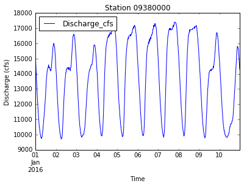

> ## Learning Objectives {.objectives}
>
> *   Explain what a for loop does.
> *   Correctly write for loops to repeat simple calculations.
> *   Trace changes to a loop variable as the loop runs.
> *   Trace changes to other variables as they are updated by a for loop.

We wrote a script for importing streamgage data through the USGS web services, cleaning up the formatting, plotting the discharge over time, and saving the figure to a file. We would like to turn this script into a tool that we can reuse for different stations and date ranges without having to rewrite the code every single time. Let's look at what we've done so far:

~~~ {.python}
import pandas as pd
import matplotlib.pyplot as plt
%matplotlib inline

new_column_names = ['Agency', 'Station', 'OldDateTime', 'Timezone', 'Discharge_cfs', 'Discharge_stat', 'Stage_ft', 'Stage_stat']

url = 'http://waterservices.usgs.gov/nwis/iv/?format=rdb&sites=09380000&startDT=2016-01-01&endDT=2016-01-10&parameterCd=00060,00065'
data = pd.read_csv(url, header=1, sep='\t', comment='#', names = new_column_names)

data['DateTime'] = pd.to_datetime(data['OldDateTime'])

new_station_name = "0" + str(data['Station'].unique()[0])
data['Station'] = new_station_name

data.plot(x='DateTime', y='Discharge_cfs', title='Station ' + new_station_name)
plt.xlabel('Time')
plt.ylabel('Discharge (cfs)')
plt.savefig('data/discharge_' + new_station_name + '.png')
plt.show()
~~~
~~~ {.output}

~~~

The station number and date range become part of the URL that we use to communicate with the server. When our script requests the data, the server reads the URL to see what we want, pulls data from a database, packages it, and passes it back to the script. The API (the protocol that governs the communication between machines) establishes the "formula" for writing the URL. As long as we follow that formula (and request data that exists in the database), the server will provide it for us.

Let's decompose the URL into its parts and combine them back into a single string:

~~~ {.python}
url_root = 'http://waterservices.usgs.gov/nwis/iv/?' # root of URL

url_1 = 'format=' + 'rdb' # file format

url_2 = 'sites=' + '09380000' # station number

url_3 = 'startDT=' + '2016-01-01' # start date

url_4 = 'endDT=' + '2016-01-10' # end date

url_5 = 'parameterCd=' + '00060,00065' # data fields

url = url_root + url_1 + '&' + url_2 + '&' + url_3 + '&' + url_4 + '&' + url_5
print url
~~~
~~~ {.output}
  http://waterservices.usgs.gov/nwis/iv/?format=rdb&sites=09380000&startDT=2016-01-01&endDT=2016-01-10&parameterCd=00060,00065
~~~

> ## Python dictionaries to URLs {.callout}
> 
> Another very useful data type in Python is the dictionary. While lists and other sequences are indexed by a range of numbers, dictionaries are indexed by keys. A dictionary is an unordered collection of key:value pairs. Keys are labels that must be unique (within any one dictionary) and can be strings or numbers. Values in a dictionary can be of any type and different pairs in one dictionary can have different types of values.
> 
> We can store the parameters of our URL in a dictionary. Here's one of several ways to add entries to a dictionary:
> 
> ~~~ {.python}
> url_dict = {} # create an empty dictionary
> 
> url_dict['format'] = 'rdb'
> url_dict['sites'] = '09380000'
> url_dict['startDT'] = '2016-01-01'
> url_dict['endDT'] = '2016-01-10'
> url_dict['parameterCd'] = ['00060','00065'] # this value is a list
> 
> print url_dict
> ~~~
> ~~~ {.output}
>     {'parameterCd': ['00060', '00065'], 'endDT': '2016-01-10', 'startDT': '2016-01-01', 'sites': '09380000', 'format': 'rdb'}
> ~~~
> 
> Just like there is the Numpy library for arrays and Pandas for tabular data, there is a Python library that provides a simple interface for accessing resources through URLs (take a look at the most popular package repository: https://pypi.python.org/). Many of the most useful libraries for scientific computing come pre-installed with the Anaconda distribution.
> 
> We can use the `urllib` package to convert the dictionary into a URL following the standard format used by web services. The order of the parameters doesn't matter to the server.
> 
> ~~~ {.python}
> import urllib
> 
> # need to set the parameter doseq to 1 to handle the list in url_dict['parameterCd']
> url_parameters = urllib.urlencode(url_dict, doseq=1)
> 
> print url_root + url_parameters
> ~~~
> ~~~ {.output}
>    http://waterservices.usgs.gov/nwis/iv/?parameterCd=00060&parameterCd=00065&endDT=2016-01-10&startDT=2016-01-01&sites=09380000&format=rdb
> ~~~

This is not the most elegant way to write the URL but it does the job. To clean things up a bit and make our script easier to reuse, we can replace the values we want to be able to change with variables:

~~~ {.python}
this_station = '09380000'
startDate = '2016-01-01'
endDate = '2016-01-10'

url_root = 'http://waterservices.usgs.gov/nwis/iv/?'
url_1 = 'format=' + 'rdb'
url_2 = 'sites=' + this_station
url_3 = 'startDT=' + startDate
url_4 = 'endDT=' + endDate
url_5 = 'parameterCd=' + '00060,00065'

url = url_root + url_1 + '&' + url_2 + '&' + url_3 + '&' + url_4 + '&' + url_5
print url
~~~
~~~ {.output}
  http://waterservices.usgs.gov/nwis/iv/?format=rdb&sites=09380000&startDT=2016-01-01&endDT=2016-01-10&parameterCd=00060,00065
~~~

We can now combine it with the rest of our code:

~~~ {.python}
import pandas as pd
import matplotlib.pyplot as plt
%matplotlib inline

########## change these values ###########
this_station = '09380000'
startDate = '2016-01-01'
endDate = '2016-01-10'
##########################################

# create the URL
url_root = 'http://waterservices.usgs.gov/nwis/iv/?'
url_1 = 'format=' + 'rdb'
url_2 = 'sites=' + this_station
url_3 = 'startDT=' + startDate
url_4 = 'endDT=' + endDate
url_5 = 'parameterCd=' + '00060,00065'

url = url_root + url_1 + '&' + url_2 + '&' + url_3 + '&' + url_4 + '&' + url_5

# import the data
new_column_names = ['Agency', 'Station', 'OldDateTime', 'Timezone', 'Discharge_cfs', 'Discharge_stat', 'Stage_ft', 'Stage_stat']

data = pd.read_csv(url, header=1, sep='\t', comment='#', names = new_column_names)

# fix formatting
data['DateTime'] = pd.to_datetime(data['OldDateTime'])
new_station_name = "0" + str(data['Station'].unique()[0])
data['Station'] = new_station_name

# plot and save figure
data.plot(x='DateTime', y='Discharge_cfs', title='Station ' + new_station_name)
plt.xlabel('Time')
plt.ylabel('Discharge (cfs)')
plt.savefig('data/discharge_' + new_station_name + '.png')
plt.show()
~~~
~~~ {.output}

~~~

## Creating Functions

To import data from a different station or for a different date range, we would manually change the values of those three variables and run the code again. This is definitely less work than downloading the correct file and plot it by hand, but changing variables could still be very tedious. At this point, our code is also getting long and complicated; what if we had thousands of datasets but didn't want to generate a figure for every single one? Commenting out the figure-drawing code is a nuisance. Also, what if we want to use that code again, on a different dataset or at a different point in a program? Cutting and pasting it is going to make our code very long and repetitive, very quickly.

We’d like a way to package the script so that it is easier to reuse. Python provides for this by letting us define things called functions, which are a shorthand way of re-executing longer pieces of code.

As an example, let's start by defining a function `fahr_to_kelvin` that converts temperatures from Fahrenheit to Kelvin:

~~~ {.python}
def fahr_to_kelvin(temp):
    return ((temp - 32) * (5/9)) + 273.15
~~~

The function definition opens with the word `def`, which is followed by the name of the function and a parenthesized list of parameter names. When we call the function, the values we pass to it are assigned to the parameter names so that we can use them as variables inside the function. The body of the function — the statements that are executed when it runs — is indented below the definition line, typically by four spaces. At the end of the function, we can write a return statement to send values back to the code that called the function.

Notice that nothing happened when we ran the cell that contains the function. Python became aware of the function but there is nothing for the function to do until we call it. Calling our own function is no different from calling any other function or module:

~~~ {.python}
print 'freezing point of water:', fahr_to_kelvin(32)
print 'boiling point of water:', fahr_to_kelvin(212)
~~~
~~~ {.output}
freezing point of water: 273.15
boiling point of water: 273.15
~~~

Our function returns a value but something is wrong. The boiling point of water in Kelvin should be 373.15 K, not 273.15 K.

Functions make code easier to debug by isolating the possible sources of error. In this case, the first term of the equation, `((temp - 32) * (5/9))`, is returning 0 (instead of 100) when the temperature is 212 F. If we look at each part of that expression individually, we find:

~~~ {.python}
5/9
~~~
~~~ {.output}
0
~~~

5 divided by 9 should be 0.5556. We have run into a problem with integer division like we discussed in the first lesson!

Let's rewrite our function with the fixed bug:

~~~ {.python}
def fahr_to_kelvin(temp):
    return ((temp - 32) * (5./9)) + 273.15

print 'freezing point of water:', fahr_to_kelvin(32)
print 'boiling point of water:', fahr_to_kelvin(212)
~~~
~~~ {.output}
freezing point of water: 273.15
boiling point of water: 373.15
~~~

## Composing Functions

Now that we’ve seen how to turn Fahrenheit into Kelvin, it’s easy to turn Kelvin into Celsius:

~~~ {.python}
def kelvin_to_celsius(temp_k):
    return temp_k - 273.15

print 'absolute zero in Celsius:', kelvin_to_celsius(0.0) 
~~~
~~~ {.output}
absolute zero in Celsius: -273.15
~~~

What about converting Fahrenheit to Celsius? We could write out the formula but we don’t need to. Instead, we can compose the two functions we have already created:

~~~ {.python}
def fahr_to_celsius(temp_f):
    temp_k = fahr_to_kelvin(temp_f)
    temp_c = kelvin_to_celsius(temp_k)
    return temp_c

print 'freezing point of water in Celsius:', fahr_to_celsius(32.0) 
~~~
~~~ {.output}
freezing point of water in Celsius: 0.0
~~~

This is our first taste of how larger programs are built: we define basic operations, then combine them in ever-large chunks to get the effect we want. Real-life functions will usually be larger than the ones shown here — typically half a dozen to a few dozen lines — but they shouldn’t ever be much longer than that or the next person who reads it won’t be able to understand what’s going on.

## Tidying up

Now that we know how to wrap bits of code in functions, we can make our streamgage data plotting code easier to read and easier to reuse. First, let's make a `import_streamgage_data` function to pull the data file from the server and fix the formatting:

~~~ {.python}
def import_streamgage_data(url):
    
    new_column_names = ['Agency', 'Station', 'OldDateTime', 'Timezone', 'Discharge_cfs', 'Discharge_stat', 'Stage_ft', 'Stage_stat']

    data = pd.read_csv(url, header=1, sep='\t', comment='#', names = new_column_names)

    # fix formatting
    data['DateTime'] = pd.to_datetime(data['OldDateTime'])
    new_station_name = "0" + str(data['Station'].unique()[0])
    data['Station'] = new_station_name
    
    return data
~~~

We can make another function `plot_discharge` to compose to plot and save the figures:

~~~ {.python}
def plot_discharge(data):
    
    data.plot(x='DateTime', y='Discharge_cfs', title='Station ' + new_station_name)
    plt.xlabel('Time')
    plt.ylabel('Discharge (cfs)')
    plt.savefig('data/discharge_' + new_station_name + '.png')
    plt.show()
~~~

The function `plot_discharge` produces output that is visible to us but has no return statement because it doesn't need to give anything back when it is called.

We can also wrap up the script for composing URLs into a function called `generate_URL`:

~~~ {.python}
def generate_URL(station, startDT, endDT):

    url_root = 'http://waterservices.usgs.gov/nwis/iv/?'
    url_1 = 'format=' + 'rdb'
    url_2 = 'sites=' + station
    url_3 = 'startDT=' + startDT
    url_4 = 'endDT=' + endDT
    url_5 = 'parameterCd=' + '00060,00065'

    url = url_root + url_1 + '&' + url_2 + '&' + url_3 + '&' + url_4 + '&' + url_5
    
    return url
~~~

Now that these three functions exist, we can rewrite our previous code in a much simpler script:

~~~ {.python}
########## change these values ###########
this_station = '09380000'
startDate = '2016-01-01'
endDate = '2016-01-10'
##########################################

url = generate_URL(this_station, startDate, endDate)
data = import_streamgage_data(url)
plot_discharge(data)

~~~
~~~ {.output}

~~~

## Testing and Documenting

It doesn't take long to forget what code we wrote in the past was supposed to do. We should always write some documentation for our functions to remind ourselves what they are for and how they are supposed to be used.

The usual way to put documentation in software is to add comments:

~~~ {.python}
# plot_discharge(data): take a DataFrame containing streamgage data, plot the discharge and save a figure to file.
def plot_discharge(data):
    
    data.plot(x='DateTime', y='Discharge_cfs', title='Station ' + new_station_name)
    plt.xlabel('Time')
    plt.ylabel('Discharge (cfs)')
    plt.savefig('data/discharge_' + new_station_name + '.png')
    plt.show()
~~~

There’s a better way to document functions. If the first thing in a function is a string that isn’t assigned to a variable, that string is attached to the function as its documentation. A string like this is called a docstring (use one set of quotes for single line strings, three sets for multi-line strings):

~~~ {.python}
def plot_discharge(data):
    '''
    Take a DataFrame containing streamgage data,
    plot the discharge and save a figure to file.
    '''
    
    data.plot(x='DateTime', y='Discharge_cfs', title='Station ' + new_station_name)
    plt.xlabel('Time')
    plt.ylabel('Discharge (cfs)')
    plt.savefig('data/discharge_' + new_station_name + '.png')
    plt.show()
~~~

Docstrings are better because Python’s built-in help system uses them as the documentation for the function:

~~~ {.python}
help(plot_discharge)
~~~
~~~ {.output}
    Help on function plot_discharge in module __main__:
    
    plot_discharge(data)
        Take a DataFrame containing streamgage data,
        plot the discharge and save a figure to file.
~~~    

## Defining Defaults:

When we use the `read_csv` function, we pass parameters in two ways: directly, as in `pd.read_csv(url)`, and by name, as we did for the parameter `sep` in `pd.read_csv(url, sep = '\t')`.

If we look at the documentation for `read_csv`, all parameters but the first (`filepath_or_buffer`) have a default value in the function definition (`sep=','`). The function will not run if parameters without default values are not provided, but all parameters with defaults are optional. This is handy: if we usually want a function to work one way but occasionally need it to do something else, we can allow people to pass a parameter when they need to but provide a default to make the normal case easier to use.

The example below shows how Python matches values to parameters when they are passed directly:

~~~ {.python}
def display(a=1, b=2, c=3):
    print 'a:', a, 'b:', b, 'c:', c 

print 'no parameters:' 
display()

print 'one parameter:'
display(55)

print 'two parameters:'
display(55, 66)
~~~
~~~ {.output}
no parameters:
a: 1 b: 2 c: 3
one parameter:
a: 55 b: 2 c: 3
two parameters:
a: 55 b: 66 c: 3
~~~

As this example shows, parameters are matched from left to right, and any that haven’t been given passed a value use the default. We can override this behavior by naming the value as we pass it in:

~~~ {.python}
print('only setting the value of c')
display(c=77)
~~~
~~~ {.output}
only setting the value of c
a: 1 b: 2 c: 77
~~~

> ## Combining strings {.challenge}
>
> "Adding" two strings produces their concatenation:
> `'a' + 'b'` is `'ab'`.
> Write a function called `fence` that takes two parameters called `original` and `wrapper`
> and returns a new string that has the wrapper character at the beginning and end of the original.
> A call to your function should look like this:
>
> ~~~ {.python}
> print fence('name', '*')
> ~~~
> ~~~ {.output}
> *name*
> ~~~

> ## Variables inside and outside functions {.challenge}
>
> What does the following piece of code display when run - and why?
>
> ~~~ {.python}
> f = 0
> k = 0
>
> def f2k(f):
>   k = ((f-32)*(5.0/9.0)) + 273.15
>   return k
>
> f2k(8)
> f2k(41)
> f2k(32)
>
> print k
> ~~~

> ## Selecting characters from strings {.challenge}
>
> If the variable `s` refers to a string,
> then `s[0]` is the string's first character
> and `s[-1]` is its last.
> Write a function called `outer`
> that returns a string made up of just the first and last characters of its input.
> A call to your function should look like this:
>
> ~~~ {.python}
> print outer('helium')
> ~~~
> ~~~ {.output}
> hm
> ~~~

> ## Rescaling an array {.challenge}
>
> Write a function `rescale` that takes an array as input
> and returns a corresponding array of values scaled to lie in the range 0.0 to 1.0.
> (Hint: If $L$ and $H$ are the lowest and highest values in the original array,
> then the replacement for a value $v$ should be $(v-L) / (H-L)$.)

> ## Testing and documenting your function {.challenge}
>
> Run the commands `help(numpy.arange)` and `help(numpy.linspace)`
> to see how to use these functions to generate regularly-spaced values,
> then use those values to test your `rescale` function.
> Once you've successfully tested your function,
> add a docstring that explains what it does.

> ## Defining defaults {.challenge}
>
> Rewrite the `rescale` function so that it scales data to lie between 0.0 and 1.0 by default,
> but will allow the caller to specify lower and upper bounds if they want.
> Compare your implementation to your neighbor's:
> do the two functions always behave the same way?

## Finishing the script

The ultimate goal for this exercise is to write a function that takes a list of stations and a date range and produces a plot of the discharge at each station.

> ## Multiple stations {.challenge}
> 
> Using loops, write a function that can accept the following list of gaging stations and the date ranges used before and produce plots of discharge at each of the stations.
> 
> stations = ['06719505', '06718550', '06710385', '06751150', '06713500', '06711565']

> ## Default values, part 1 {.challenge}
> 
> Give your function default parameters for the date range so that it spans all of 2015.

> ## Default values part 2 {.challenge}
> 
> Give your function default parameters for the date range so that, by default, it spans the last 30 days. To get today's date and the date 30 days ago, you can use:
> 
> ~~~{.python}
> import datetime
> 
> today = datetime.date.today()
> diff30 = datetime.timedelta(days=30)
> 
> print 'today:', today
> print '30 days ago:', today - diff30
> ~~~
>
> One way to do this is to use dummy default values that you can easily check for. Another is to use `None` as the default value. Try both!

>## Single plot {.challenge}
>
>Rewrite your script so the discharge for all of the stations in the list are plotted together. Make sure this works regardless of the length of the list!

>## Optional plot styles {.challenge}
>
>Add optional parameters to your function that let the user choose between plotting stations individually or together.
